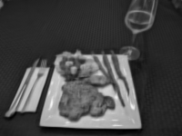

# Sparse-Dictionary-Learning
 
This repo demonstrates the capabilities of Sparse Dictionary Learning 
on image reconstruction and denoising. 

### Mathematical Overview

Each image is broken up into "patches", usually 8x8 block. 
This are the fundamental objects we work with.
Each patch can be represented by a single vector 
$v\in \mathbb{R}^d$ where $d=(8\times 8)=64$. (Here we are assuming our image is in gray scale, 
however this works perfectly fine in color where $d = (8\times 8\times 3)$.)

Select a set $D:=\{ u_i \}_{i=1}^K \subset \mathbb{R}^d$ of unit vectors, called "atoms". 
It is important that $K>d$, so the set may be spanning (almost always is spanning) 
but is never a basis. The set $D$ is called a "dictionary" and typically is viewed 
as a $d\times K$ matrix. $\alpha$ 

Each patch $8\times 8$ patch has a vector representation $\vec{y} \in \mathbb{R}^d$. 
This vector $\vec{y}$ has a "sparse representation" $\vec{x}$. 

$$ \vec{y} \approx \vec{x} := D \vec{\alpha}$$

The best representation of $\vec{y}$ is the vector $\vec{\alpha}$ which minimizes

$$ ||\vec{y} - D \vec{\alpha} ||_2$$

Of course since $D$ spans $\mathbb{R}^d$, this is an overdetermined problem. 
We add a constraint that the $L^0$-norm of $\vec{\alpha}$ is bounded by a 
constant $L$. 
This gives the optimization problem 

$$ ||\vec{y}_i - D \vec{\alpha}_i ||_2 \quad s.t. ||\vec{\alpha}_i||_0\leq L$$

or rather: Find the $D$ and $A=[ \vec{\alpha}_1, \dots, \vec{\alpha}_N ]$ so that 

$$ || Y - D A ||_2$$ 

is minimized for $Y = [\vec{y}_1, \dots, \vec{y}_N]$,  subject to the contraint

$$ ||\vec{\alpha}||_0\leq L.$$


### Algorithms

Analytically finding optimal sparse representation requires preforming ${K \choose L}$ 
computations, which is unreasonable. In stead, we use an approximate form. 
There are many algorithms that do this, but we use Orthogonal Matching Pursuit and Matching Pursuit. 

Finding the optimal dictionary is equally difficult. We are using that k-SVD algorithm, 
first proposed in this paper: https://legacy.sites.fas.harvard.edu/~cs278/papers/ksvd.pdf. 
We are slightly modifying the algorithm by replacing unused atoms as soon as they are skipped over. 
We are replacing them with the worst respresented signal. This method was examined and 
determined to be optimimal in the following paper: https://cs.unibuc.ro//~pirofti/papers/Irofti16_AtomReplacement.pdf.

## Evaluation Metrics

The simplest and most intuitive evalutation metric is the Mean Square Error ($MSE$)
$$MSE = \frac{1}{d}|| y - x ||_2^2$$
between a signal $y$ and its approximation $x$.
However a standard in the industry is to use Peak Signal to Noise Ratio ($PSNR$)
$$ PSNR = 10 \log_{10}\Big( \frac{ ||y||_\infty^2}{ \frac{1}{d}||y - x ||_2^2}\Big) $$
which since the majority of signals will have $||y||_\infty \approx 255$, the $PSNR$ has a logrithmic relation to the $MSE$, and therefore contain an identical amount of information.

Another standard evaluation metric is the Structural Similarity Index Measure ($SSIM$),
$$ SSIM(y, x) = l(y, x) c(y, x) s(y,x), $$
which is the product of three distortion measurements. This takes values in $[-1,1]$ where higher is better. Note that this value is in practice never negative, ast that would require special engineering, so we consider it as a value in $[0,1]$.
Luminance Distortion
$$ l(y,x) = \frac{2 \mu_y \mu_x + C_l}{\mu_y^2 + \mu_x^2 + C_l} $$
Contrast Distortion
$$ c(y,x) = \frac{2 \sigma_y \sigma_x + C_c}{\sigma_Y ^2 + \sigma_x^2 + C_c} $$
Structural Comparison
$$ s(y,x) = \frac{ \sigma_{yx} ++ C_s}{ \sigma_Y \sigma_x + C_s} $$
where
$$\mu_x = \frac{1}{d} \sum x^{(i)} $$
$$\sigma_x^2 = \frac{1}{d} \sum(x^{(i)} - \mu_x)^2 $$
$$\sigma_{xy} = \frac{1}{d} \sum (x^{(i)} - \mu_x)(y^{(i)} - \mu_y) $$

These metrics give an idea of what area an image reconstruction is doing better or worse on.

We will measure all of these qnatities, plus run-time (as a proxy for "compute") and gain (the improvement of these metrics). We will typically only display the $PSNR$, however when a more indepth analysis is called for, we will display the rest.

*A comparison of these metrics is found in here https://ietresearch.onlinelibrary.wiley.com/doi/epdf/10.1049/iet-ipr.2012.0489
### Stochastic Partial Image Reconstruction

Typically image reconstruction is done by preforming sparse coding on every contiguous patch 
of the image, and then averaging the results over the whole image. So for patches of size 
$8 \times 8$ on a $200 \times 150$ pixel image, that would be 
$(200-7)\times (150 - 7) =  27,599$ sparse coding opperations! 
However the patches are completely over lapping, which means that hey repeat
a lot of the same information. Intuitively, we might learn everything we need to learn 
about the $(x_0, y_0)$ pixel from the first 3 patches that contain it, makeing the 
next 61 patches redundant. 

This redundancy might not be a problem when there is a lot of compute available. 
However when running image reconstruction on my personal laptop, compute is at a 
premium. Because of this, I am using a **Stochastic Partial Image Reconstruction (SPIR)** 
method. This means that we randomly sample patches until the difference in 
error between a partially reconstructed image and a fully reconstructed image is 
below a predetermined threshold. 

In order to determine what percentage of patches are nessisary, we conducted a series 
of 3 tests. The graph below shows the results of these tests. Note that the 
SPIR seems to always underestimate. The true error value 
is shown in the legend for reference. Note that for PSNR better image reconsturctions 
need more patches, however that is not the case for SSIM. The details on all three
tests are presented below.


**Test 1 - "Milanese"**
A simple reconstuction test on a $200\times 150$ pixel black and white photo of chicken "Milanese", where the training data is the same image. Parameters are: L=5, K=100, N=300, iters=10, patch_shape = [8,8]

**Test 2 - "Tea Eggs"**
A denoising test on a $200\times 150$ pixel black and white photo of "Tea Eggs". The training data will be 4 other photos of the same size. The added noise has std = 100. The parameters are: L = 10, K = 200, N = 500, iters = 20, patch_shape = [8,8]

**Test 3 - "Persimmon Salad"**
A color-adding test on a $200\times 150$ pixel "RB0" photo (missing the green channel) of a "Persimmon Salad". The training data will be 9 other similarly sized and colored photos. The parameters are: L = 5, K = 200, N = 800, iters = 10, patch_shape = [8,8,3]

#### Conclusion: Only ~10% of Patches are needed for Most Purposes

# Usage

First you must train the dictionary. To do that, follow the following steps. 

#### Dictionary Training

Have a parameters file saved as a .yaml file. 
You can edit these values as you see fit. 
You will be asked to enter the path to this fill after --training_parameters.
```azure
# This is the parameters.yaml file
N : 300 # The batch size when random sampling your training data.
K : 150 # Number of atoms in the dictionary.
I : 10 # Number of iterations to run the k-SVD algorithm to train your dictionary. Values are typically between 0 and 20.
L : 10 # Number of atoms to use in sparse coding. Inscreased values increase preformance at the cost of run time.
Patch_Shape : [8,8] # This size of the patches in pixels. If the image has color, set it equal to [8,8,3].
Partial : False # If False, you will get the full image reconstruction algorithm. If True, you will get the Stochastic Partial Image Reconstruction (SPIR) algorithm. This will take about 20% of the time as the full agorithm, be about 90-90% as accurate, but will most likely have dead pixels on the sides.
```

Have a image_paths.yaml file which contains the paths to the training images.
You will be asked to enter the path to this file after --image_paths
```azure
# This is the image_paths.yaml file. It contains a list of all the paths that the training images will be pulled from.
paths:
    - Compressed Images/cheese_board.jpg
    - octopus_test_image.jpg
```

Know the path you want you dictionary to end up at. This will be pickled, 
so it is suggested that the file path end in '.pkl'. 
You will be asked to enter this path after --output_dictionary_path

Execute the code
```azure
train_dictionary.py --training_images image_paths.yaml --training_params params.yaml --output_dictionary_path test_dictionary.pkl
```

Your dictionary is now stored as a pickle file in the file path you entered.

#### Image Reconstruction

Recall the .pkl path that your dictionary is stored in. You can use the one you just 
created, or use a different one. You will be asked to enter this path after
--input_dictionary_path

Have a parameters.yaml file. This is the EXACT same file as before.
You will be asked to enter the path to this fill after --reconstruction_parameters.

```azure
# This is the parameters.yaml file
N : 300 # The batch size when random sampling your training data.
K : 150 # Number of atoms in the dictionary.
I : 10 # Number of iterations to run the k-SVD algorithm to train your dictionary. Values are typically between 0 and 20.
L : 10 # Number of atoms to use in sparse coding. Inscreased values increase preformance at the cost of run time.
Patch_Shape : [8,8] # This size of the patches in pixels. If the image has color, set it equal to [8,8,3].
Partial : False # If False, you will get the full image reconstruction algorithm. If True, you will get the Stochastic Partial Image Reconstruction (SPIR) algorithm. This will take about 20% of the time as the full agorithm, be about 90-90% as accurate, but will most likely have dead pixels on the sides.
```

Know the path of the input image. This will be the image you want reconstructed. 
You will be asked to enter it after --input_image_path.

Know the path where you want your reconstructed image to go.
You will be asked to enter it after --output_image_path.

Run the code
```azure
image_reconstruction.py --input_dictionary_path test_dictionary.pkl --reconstruction_params params.yaml --input_image_path small_gray_dinner.jpg --output_image_path test_image.jpg
```
#### Example 
There is an example of how to follow these instruction in Example.ipynb

## Tests and Test Results
There are plenty of tests, test results, and images in the notebook Test.ipynb

## Process
The process of defining all of the Classes and code is recorded in detail in 
Classes.ipynb

## Code
All of the actual code is stored in Classes.py.
Note that this contains the exact same information as in Classes.ipynb. 
The only difference is that the note book will be easier to read if you want the 
full story, and the python file will be easier to read if you know what you're looking for. 

## Example Results: Comparison

Here are the results of a few tests. Note that these tests are purely to get an idea of what the algorithms are capable of. A full battery of tests will be preformed in another notebook.

ALl tests are run by compressing and reconstructing a single image. The algorithm is trained and tested on the same image.

I = number of iterations of the dictionary learning algorithm (k-SVD)
K = number of atoms
L = max number of atoms allowed in a sparse representation
N = number of random samples provided (batch size) at each step

### Dictionary Learning Iterations
How many iterations (I = num_iters) of the dictionary learning (k-SVD) algorithm do we need to run? Note that at I=0 our atoms are initialized as random patches of our image.

| I = 0 | I = 1 | I = 10 | Original |
|-------|-------|--------|----------|
|  |  |  |  |

Notice how there isn't much of a difference.

### Batch Size
How many samples should I provide? Both experiments were preformed with I=10

 N=100  | N=500                                          | Original |
-------|------------------------------------------------|----------|
|  |  |  |

Again, not much of a change.

### Atoms in the Sparse Representation
How many atoms should I use in the sparse representation?

 L=5 | L=20                                                                                   | Original |
-------|----------------------------------------------------------------------------------------|----------|
|  |  |  |

We finally have a dramatic improvement. It seems that of all the parameters, L is by far the most important.


# Where to Spend Compute?
There are lot different parameters to tweak. Here is a break down 
of which parameters cost more run time and decrease error.


As you can see, increase the number of atoms is by far the most 
cost effective way to decrease error. 

Of course we can do a much better analysis by running many more tests.


